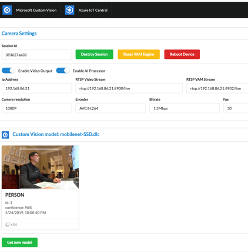

---

title: "Community Project: Vision AI Dev provisioning with Azure IoT Central"
permalink: /docs/testing_page
excerpt: "Vision AI Dev provisioning with Azure IoT Central"
variable:
  - platform: windows
    name: Windows
  - platform: macos
    name: macOS
comments: 
  provider: "disqus"
  disqus: 
    shortname: https-azure-github-io-vision-ai-devkit-pages-docs-community-pr.disqus.com
last_modified_at: 2019-08-07
---
<html><table>
<tr><td>
<b> Summary </b> </td></tr>
<tr>
    <td width="50%">
    
This project demonstrates the successful implementation of a Vision AI DevKit device provisioning itself with Azure IoT Central services to enable the live reporting of telemetry, state, events, and settings with the ability to manually control the ML model. This project can be considered a proof of concept of IoT Edge device's integration with IoT Central before IoT Central officially supports IoT Edge devices.

<td width="50%">  </td>
</tr>
</table></html>

<html><table>
<tr><td>
<b> Implementation </b> </td></tr>

<tr><td>
This project is implemented as a NodeJS micro service and React Web client. The web client allows the user to interact directly with the device to control it as well as experiment with Custom Vision AI models.

This project has potential for BLANK industries; for example, the use of IoT Central with the Vision AI DevKit camera can be used to BLANK to ensure BLANK.
</td></tr>

 </table>
</html>

<html><table>

 <tr>
    <td> <b> Software and Services used</b> </td>
    <td> <b> Hardware </b> </td> 
    <td rowspan="24"></td> </tr>
 <tr>
    <td> <ul type="disc" >
            <li>Azure IoT Central</li>
            <li>Visual Studio Code</li>
            <li>NodeJS 10x (with NPM)</li>
            <li>Android Debug Bridge (ADB) tools</li>
         </ul> 
   </td> 
    <td> <ul type="disc">
            <li>Vision AI DevKit camera</li>
         </ul>
   </td>
 </tr>
 </table>
</html>

<html><table>
<tr><td>
<b> Repository </b> </td></tr>

<tr><td>
Find more information and relevant code here: <a href="https://github.com/sseiber/peabody-local-service/blob/master/README.md">Github</a>.
</td></tr>
 </table>
</html>

<html><table>
<tr><td>
<b> Future Improvements and Project Suggestions </b> </td></tr>

<tr><td>
  <add thoughts and ideas in terms of how "community" could develop these assets further to add functionality/application to project>
</td></tr>
 </table>
</html>

<html><table>
<tr><td>
<b> About the Creator </b> </td></tr>
<tr>
    <td width="50%">
    
Scott Seiber is ... <add a short bio about your experience and interests, why you are working on this project>

You can learn more about what Scott is working on <a href="https://github.com/sseiber">here</a>.

</td>
<td width="50%">  </td>
</tr>
</table></html>

<noscript>Please enable JavaScript to view the <a href="https://disqus.com/?ref_noscript">comments powered by Disqus.</a></noscript>
                            

