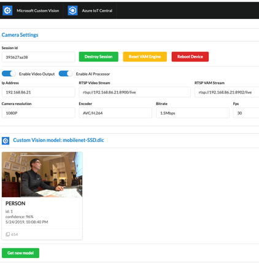

 
<html>
<table><tr><td><b>Summary</b></td></tr>
<tr><td width="50%">
This project introduces a Vision AI module with a web client that allows the user to interact directly with the device to control it as well as experiment with Custom Vision AI models. It also demonstrates an implementation of a Vision AI DevKit device provisioning itself with Azure IoT Central services to enable the live reporting of telemetry, state, events, and settings with the ability to manually control the ML model. 
  While it is a fully working sample with detailed instructions in the README it is also meant to be a resource to help you build your own custom implementation.   </td>
<td width="50%">  </td></tr>
</table></html>
<html><table>
<tr><td>
<b> Implementation </b> </td></tr>
<tr><td>
This project is implemented as a NodeJS micro service and React Web client. While the IoT Central support for module deployments is still in the works the project uses IoT Hub for module deployment. The module then connects to IoT Central to interact directly with the device.  
This project is an excellent way to showcase the power of intelligent edge camera with telemetry and other functions built in.
</td></tr></table></html>
<html><table>
 <tr>
    <td> <b> Software and Services used</b> </td>
    <td> <b> Hardware </b> </td> 
    <td rowspan="24"></td> </tr>
 <tr>
    <td> <ul type="disc" >
            <li>Azure IoT Central</li>
            <li>Visual Studio Code</li>
            <li>NodeJS 10x (with NPM)</li>
            <li>Android Debug Bridge (ADB) tools</li>
         </ul> 
   </td> 
    <td> <ul type="disc">
            <li>Vision AI DevKit camera</li>
         </ul>
   </td>
</tr>   
</table></html>
<html><table>
<tr><td><b> Repository </b></td></tr>
<tr><td>
Find more information and relevant code <a href="https://github.com/sseiber/peabody-local-service/blob/master/README.md">here</a>.
 Users are encouraged to innovate and continue to improve the functionality of current projects. 
</td></tr>
<tr><td>
<b> Future Improvements and Project Suggestions </b> </td></tr>
<tr><td>
  Feel free to fork the project and contribute back any improvements or suggestions. Contributors and maintainers are encouraged.
</td></tr>
</table></html>
<html><table>
<tr><td width="70%"><b> About the Creator </b> </td>
<td rowspan="2" width="30%">  </td></tr>
<tr><td>
Scott Seiber is a long-time Microsoft software engineer who is focused on the cross-section of hardware and software. He is currently working in the Azure IoT organization enabling partners with their digital transformations.
 
You can learn more about what Scott is working on <a href="https://github.com/sseiber">here</a>.
</td></tr>
</table></html>

<noscript>Please enable JavaScript to view the <a href="https://disqus.com/?ref_noscript">comments powered by Disqus.</a></noscript>
                            

