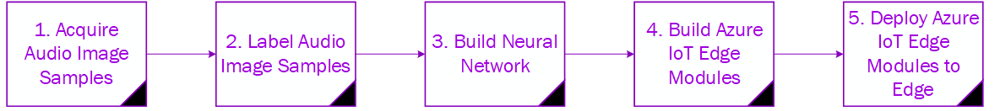

 
<html>
<table><tr><td><b>Summary</b></td></tr>
<tr><td>
This project uniquely utilizes the Vision AI Developer Kit to aid in training a Neural Network based on features extracted from audio files. In this sample use case, the water level of a fountain can be determined by using audio classification through a machine learning model based on the sound produced by water splashing into a larger volume of different depths. This demonstrates both how audio can be used in some cases as a cheaper alternative to vision with 360° field coverage that is still possible using the DevKit and how to train a model using the Azure Machine Learning Service.    </td></tr>
</table></html>

<video width="640" height="480" controls>
  <source src="vaidk-audio-github walkthrough.mp4" type="video/mp4">
Your browser does not support this video tag.
</video>

<video width="640" height="480" controls>
  <source src="videoaisolutionwalkthrough.mp4" type="video/mp4">
Your browser does not support this video tag.
</video>

<html><table>
<tr><td>
<b> Implementation </b> </td></tr>
<tr><td>
This project following a 5-step process to acquire, label, train, build and push to the Vision AI Devkit, as shown below.
</td></tr>
<tr>
<td></td>
</tr>
</table></html>

<html><table>
<tr>
    <td width = "50%"> <b> Software and Services used</b> </td>
    <td width = "50%"> <b> Hardware </b> </td> 
    <td rowspan="24"></td> </tr>
 <tr>
    <td> <ul type="disc" >
            <li>Azure IoT Edge</li>
            <li>Docker Desktop</li>
            <li>Azure Machine Learning</li>
            <li>Visual Studio Code</li>
            <li>Python</li>
         </ul> 
   </td> 
    <td> <ul type="disc">
            <li>Vision AI DevKit</li>
         </ul>
   </td>
</tr> 
</table></html>  

<html><table>
<tr><td><b> Repository </b></td></tr>
<tr><td>
Find all relevant information for full implementation of this product <a href="https://github.com/ksaye/vision-ai-developer-kit-audio" target="_blank">here</a>.  
Users are always encouraged to innovate and continue to improve the functionality of current projects. 
</td></tr>
<tr><td>
<b> Future Improvements and Project Suggestions </b> </td></tr>
<tr><td>
This sample demonstrates one very linear way to train a model in a very controlled environment with just a few thousand audio files.  Future improvements might include: <ol>
<li>Modifying the AudioCapture module to read and write TWINs</li>
<li>Modifying the AudioInferece module to include updates for audio modules</li>
<li>Modifying the Label script to use a small model to later label non linear sample files</li>
<li>Modify the AudioCapture module to collect files and incorporate the pipeline capability of the Azure Machine Learning Service</li>
</ol>

  
  Feel free to fork the project and contribute back any improvements or suggestions. Contributors and maintainers are encouraged.
</td></tr>
</table></html>

<html><table>
<tr><td width="30%"><b> About the Creator </b> </td></tr>
<tr><td rowspan="2" width="30%">  </td></tr>
<td width = "70%">
Kevin Saye is an IoT Architect and a student of AI.  From soldering resistors to writing code for MCUs to scaling out with MPP solutions, he is squarely focused on that thing he was meant to do in life, IoT.  He regularly publishes ‘how to’ articles, based on customer, partner and personal experiences and challenges – with the goal to share and enable peers in the community.  
He can be followed at: <a href="https://kevinsaye.wordpress.com/" target="_blank"> https://kevinsaye.wordpress.com/ </a>.  
 
You can also learn more about what Kevin is working on <a href="https://github.com/ksaye/" target="_blank">here</a>.
</td>
</table></html>

<!-- 

<noscript>Please enable JavaScript to view the <a href="https://disqus.com/?ref_noscript">comments powered by Disqus.</a></noscript>
                             -->

