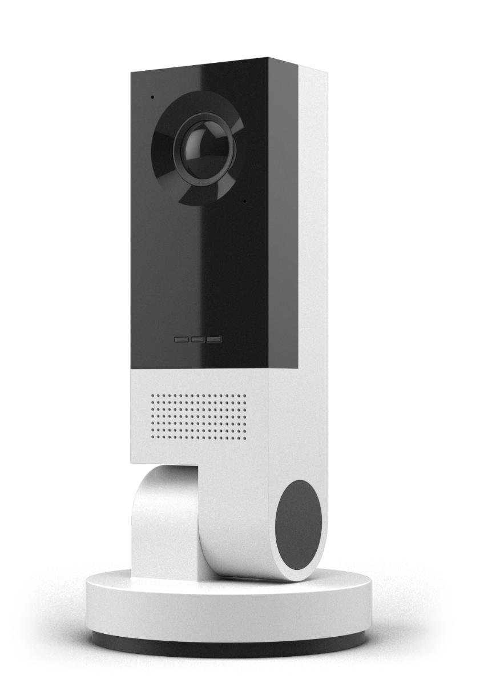

## Start your machine learning journey with Vision AI DevKit

Vision AI Dev Kit provides a quick start to intelligent edge, machine learning and Azure services. you can start your machine learnind journey with this Dev Kit or use it to proof your concept in enterprise use before deciding to go to production.

You can use <a href="http://Customvision.ai">Customvision.ai</a>, a web portal with easy to use UI, to train your AI model and export it in the format that can be directly deployed to Vision AI Dev Kit. This enables very fast iterations in terms of being able to test out your AI model in real life.

<html><table>
 <tr>
    <td>Sold by</td>
    <td>Arrow</td> 
    <td rowspan="12"></td>Vision AI Dev Kit</tr>
 <tr>
    <td>Manufacturer</td> 
    <td>Altek</td>
 </tr>
 <tr>
    <td>SoC</td>
    <td><a href="https://www.qualcomm.com/products/qcs603">Qualcomm QCS603</a></td> 
 </tr>
 <tr>
    <td>Operating System</td>
    <td>Yocto Linux</td> 
 </tr>
 <tr>
    <td>Category</td>
    <td>Intelligent Edge Camera</td> 
 </tr>
 <tr>
    <td>Product spec</td>
    <td><a href="https://store.altek.com.tw/qualcomm/product/ai-camera-altek-azure-iot-starter-kit#TECH-NODE">coming soon</a></td> 
 </tr>
 <tr>
    <td>HW Acceleration</td>
    <td>GPU (not optimized), DSP optimized for vision AI inferencing</td> 
 </tr>
 <tr>
    <td>Web page</td>
    <td><a href="http://www.visionaidevkit.com">www.visionaidevkit.com</a></td> 
 </tr>
 <tr>
    <td rowspan="2">Assets and tutorials</td>
    <td><a href="https://azure.github.io/Vision-AI-DevKit-Pages/docs/Tutorial-HOL_Using_the_VisionSample/">Tutorials</a></td> 
 </tr>
 <tr>
    <td><a href="https://github.com/Microsoft/vision-ai-developer-kit">Assets (GitHub)</a></td> 
 </tr>
 <tr>
    <td>Community</td>
    <td><a href="https://techcommunity.microsoft.com/t5/IoT-Devices/bd-p/HardwareEngineering">IoT Device Techcommunity</a></td> 
 </tr>
  <tr>
    <td>Certification</td>
    <td>Azure IoT, <a href="https://catalog.azureiotsolutions.com/details?title=Vision-AI-DevKit-Camera">Link to device catalog</a></td> 
 </tr>